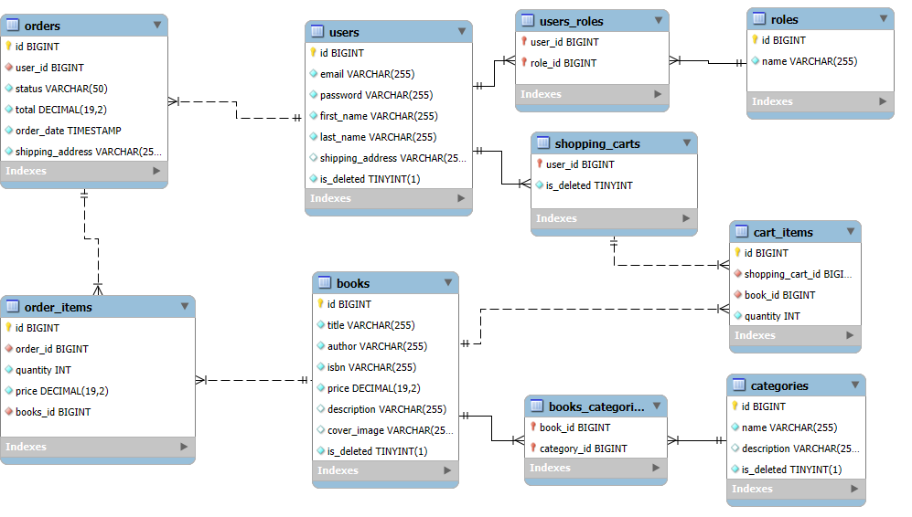

# Book store API

## 🚀 Introduction

The Online Bookstore API is a multifunctional system designed to manage unlimited books in your store.
This application offers a user-friendly interface for administrators and customers, 
providing a comprehensive toolset for efficiently managing the bookstore. 
The project focuses on the server-side, providing a stable and flexible foundation for future development.

## ✨ Inspiration

This project was inspired by the desire to create a simple and efficient server-side system for managing a bookstore.
The inspiration came from observing existing solutions, which are often overly complex and bloated with features.
I aimed to develop a minimalist and straightforward API that easily integrates with external clients, 
allowing administrators to efficiently manage the book catalog and users to conveniently interact with the store.
___
##  🛠️ Technologies and Tools

### Programing language:

* Java 17: The platform for building and running the application.

### Frameworks:

* Spring Boot: A powerful framework for building Java-based enterprise applications.
* Spring Security: Ensures application security with features such as authentication and authorization.
* Spring Data JPA: Simplifies the data access layer, facilitating interactions with the database.
* Swagger (Spring doc OpenAPI): Enables comprehensive API documentation, easing developer understanding and interaction.

### Database:

  * MySQL: A reliable and scalable relational database management system.
  * H2 (for testing): An in-memory database that provides a lightweight solution for testing and development.

### ORM and Database Versioning:

  * Liquibase: Manages database schema changes and version control.
  * Hibernate:  A robust ORM framework that simplifies database interactions.

### Containerization:

  * Docker: Containerizes the application for consistent and portable deployment.

### Mapping:

  * MapStruct: Simplifies the implementation of mappings between Java bean types.
  * Lombok: Reduces boilerplate code through annotations, enhancing developer productivity.

### Authentication and Security:

  * JSON Web Tokens (jjwt): Ensures secure user authentication.

### Testing:

  * Spring Boot Starter Test: A comprehensive testing framework that simplifies the testing of Spring Boot applications.
  * Test-containers (MySQL, JUnit): A Java library that provides lightweight, throwaway instances of common databases and other services for testing.
  * Spring Security Test: A module that supports testing Spring Security components.

### Build Tools:

  * Maven (with Checkstyle and Compiler plugins): A powerful build automation tool used for managing project dependencies and lifecycle.
    * Checkstyle plugin: helps maintain code quality by enforcing coding standards.
    * Compiler plugin: ensures that the project compiles with the specified Java version, improving build consistency and reliability.
___

## 💾 Database structure

___

## ⚙️ Project Functionalities

### 🔐 User Authentication:

| HTTP Request | Endpoint        | Description                                                   |
|:-------------|:----------------|:--------------------------------------------------------------|
| **POST**     | `/login`        | Login user. Will return a JWT token for authorizing requests. |
| **POST**     | `/registration` | Register as new users with role "USER"                        |
 
After registration, users need to log in. This is the first and most crucial step.  
Further functionality is restricted based on user roles (user and administrator).

**The application already has a user with the ADMIN role:**
- **email: admin@example.com**
- **password: password**  

**For a user with the USER role - it is necessary to register**

### 📚 Book Management:  
  
* #### For users with the role of "user," the following functions are available:
| HTTP Request | Endpoint        | Description                                                         |
|:-------------|:----------------|:--------------------------------------------------------------------|
| **GET**      | `/books`        | Viewing all books                                                   |
| **GET**      | `/books/{id}`   | Searching for a book by its ID                                      |
| **GET**      | `/books/search` | Searching for a book based on specified parameters (title, author)  |

* #### For administrators, the available functions include:

| HTTP Request | Endpoint      | Description                                                 |
|:-------------|:--------------|:------------------------------------------------------------|
| **POST**     | `/books`      | Creating a new book instance. A request body must be passed |
| **PUT**      | `/books/{id}` | Updating an existing book. A request body must be passed    |
| **DELETE**   | `/books/{id}` | Deleting a book by id from the database.                    |

### 🗂️ Category Management:
* #### For users the following functions are available:
| HTTP Request | Endpoint             | Description                               |
|:-------------|:---------------------|:------------------------------------------|
| **GET**      | `/categories`        | View all categories.                      |
| **GET**      | `/categories/{id}`   | Searching for a category by its ID.       |
| **GET**      | `/categories/books`  | Search for books by a specified category. |

* #### For administrators, the following functions are available:

| HTTP Request | Endpoint            | Description                                                     |
|:-------------|:--------------------|:----------------------------------------------------------------|
| **POST**     | `/categories`       | Creating a new category instance. A request body must be passed |
| **PUT**      | `/categories/{id}`  | Updating an existing category. A request body must be passed    |
| **DELETE**   | `/categories/{id}`  | Deleting a category by id from the database.                    |

### 🛒 Shopping Cart Management:
All functions in this section are available exclusively to users with the "USER" role.

| HTTP Request | Endpoint             | Description                                                                                              |
|:-------------|:---------------------|:---------------------------------------------------------------------------------------------------------|
| **POST**     | `/cart`              | Add a book as a cart item to their cart (if the book is already in the cart, its quantity will increase) |
| **GET**      | `/cart`              | View all books currently in the cart.                                                                    |
| **PUT**      | `/cart/{cartItemId}` | Change the quantity of books.                                                                            |
| **DELETE**   | `/cart/{cartItemId}` | Remove a book from the cart.                                                                             |

### 📝 Order Management:
* #### For users the following functions are available:
| HTTP Request | Endpoint                           | Description                                                                          |
|:-------------|:-----------------------------------|:-------------------------------------------------------------------------------------|
| **POST**     | `/orders`                          | Create an order based on their shopping cart by simply providing a shipping address. |
| **GET**      | `/orders/`                         | View order history.                                                                  |
| **GET**      | `/orders/{orderId}/items`          | Search for individual orders by ID.                                                  |
| **GET**      | `/orders/{orderId}/items/{itemId}` | View individual order items.                                                         |

* #### For administrators, the following function is available:

| HTTP Request | Endpoint            | Description                                              |
|:-------------|:--------------------|:---------------------------------------------------------|
| **PATCH**    | `/orders/{orderId}` | Change the order status (Pending, Delivered, Completed). |
---
## 🐳 How to run this app using Docker
1. Install and run [**Docker**](https://www.docker.com/products/docker-desktop/);
2. Clone repo;
3. Configure all the necessary fields in the .env file;
4. Open a terminal and navigate to the root directory of the project on your machine;
5. Build the project by command `mvn clean install`;
6. Run the application using Docker Compose `docker-compose up`;  

After these steps use the link:  
 *http:// localhost: SPRING_LOCAL_PORT/swagger-ui/index.html* (SPRING_LOCAL_PORT - configured in the .env file.)  
For example: http://localhost:8088/swagger-ui/index.html

Author [*Vitaliy Filimonov*](https://github.com/vfilimo)